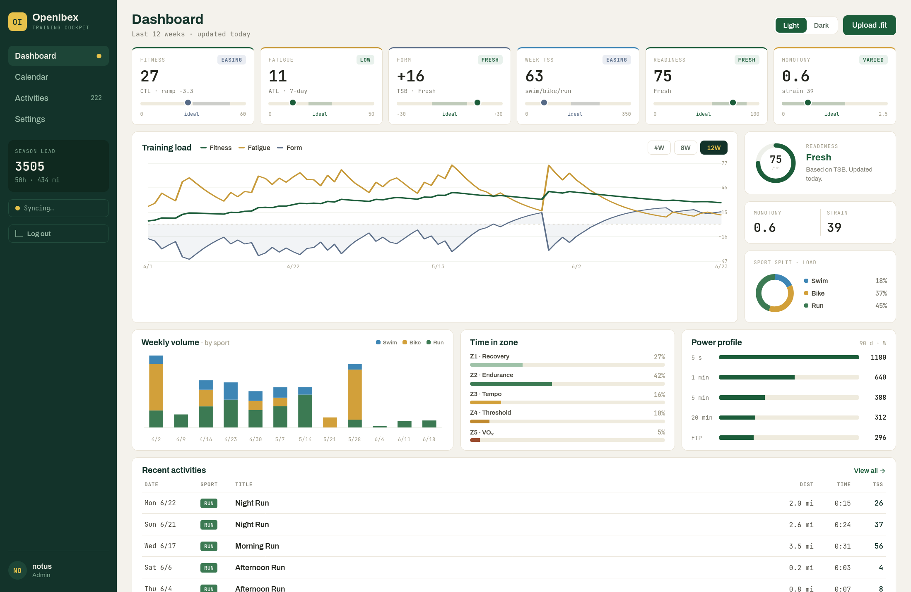

# OpenIbex

[](https://github.com/notusknot/openibex/actions/workflows/ci.yml)

A self-hosted training platform for endurance athletes. 



## Features

- **Activities** — upload FIT files, browse, search, filter, and sort your full training history
- **Planned workouts & calendar** — schedule sessions and see planned vs. completed side by side
- **Calendar matching** — automatically links planned workouts to the activities that fulfilled them
- **Analytics** — training load, fitness/fatigue, and trends over any date range
- **Garmin bulk import** — load your entire history from a Garmin account data export (no API, no credentials)
- **Garmin Connect sync** — optional, experimental auto-sync of new activities ([details](#garmin-connect-sync-experimental))
- **Data export & backup** — generate a full export of your data at any time
- **Self-contained** — single container, SQLite, everything stored under one `./data` directory

<!-- screenshot: activities list -->
<!-- screenshot: analytics -->

## Quickstart (Docker Compose)

```bash
cp .env.example .env
```

Generate a strong session secret and paste it into `.env` as `SESSION_SECRET=...`:

```bash
openssl rand -base64 32
```

If you want to use the experimental Garmin Connect sync feature, generate another secret and paste it into `.env` as `SYNC_ENCRYPTION_KEY`:

```bash
openssl rand -base64 32
```

If you are running behind a reverse proxy, set `ORIGIN` in `.env` to your domain.

Then start the app:

```bash
docker compose up -d --build
curl -s http://localhost:3000/api/health     # -> { "ok": true }
```

Open `http://localhost:3000/register` and create your account. Note that the first user becomes the admin. Registration is closed to new users after that. Set `OPEN_REGISTRATION=true` in `.env` if you want to allow more.

All data is stored in `./data`, which is mounted to `/data` in the Docker container. The container takes ownership of this directory automatically on startup, so there's no manual `chown` step — `docker compose up -d --build` is all you need. By default the app runs as uid/gid `1000`; if the host user that owns `./data` has a different uid, set `PUID`/`PGID` in `.env` to match (see [Configuration](#configuration)). To back up your data, simply back up the `./data` directory.

## Configuration

All configuration is via environment variables in `.env`:

| Variable | Default | Description |
| --- | --- | --- |
| `SESSION_SECRET` | — | **Required in production.** Long random value (16+ chars). |
| `SESSION_TTL_DAYS` | `30` | Session lifetime. |
| `OPEN_REGISTRATION` | `false` | Allow registration beyond the first user. |
| `SYNC_ENCRYPTION_KEY` | — | Required only for Garmin Connect sync (see below). |
| `PUID` | `1000` | Host uid that owns `./data`; the app runs as it and the entrypoint chowns `/data` to match. |
| `PGID` | `1000` | Host gid counterpart to `PUID`. |

## Deploy on NixOS (flake module)

OpenIbex ships a flake with a NixOS module that runs it on bare metal (a plain systemd service, no
Docker) behind your own reverse proxy. See **[docs/nixos.md](docs/nixos.md)** for setup, options, and
how to keep the flake input up to date.

## Garmin bulk import

Import your full history from a Garmin account data export (no Garmin API or credentials involved). To do so, request the export from your Garmin account settings, download and extract it, then run:

```bash
pnpm import:garmin -- --user you@example.com --path /path/to/extracted/garmin-export
```

The importer recursively finds `.fit` files, removes duplicates, and logs failures without aborting. It's safe to re-run the same export. Results show at `http://localhost:3000/imports`.

## Garmin Connect sync (experimental)

> ⚠️ **Experimental** This talks to Garmin Connect through an **unofficial** library by logging in as you. Automated access is against Garmin's TOS, two-factor auth is not supported, and Garmin can break the integration at any time.

Once connected, OpenIbex pulls new activities when you open the app (limited to once per 15 minutes) plus a manual **Sync now** button. There is no background worker. Set `SYNC_ENCRYPTION_KEY` (`openssl rand -base64 32`) to encrypt the stored session tokens, then connect under **Settings → Integrations → Garmin Connect**. For full history, use the bulk importer.

## Local development

```bash
cp .env.example .env
pnpm install
pnpm db:migrate
pnpm dev          # http://localhost:3000
```

Requires Node.js 20+ (the repo's Nix flake pins Node 22) and pnpm 10+. If you use Nix, `direnv allow` sets up the toolchain and environment automatically.

> **Contributing?** See [docs/development.md](docs/development.md) for the full feature lifecycle (branch → PR → merge), the enforcement model, and how to cut a release.

If `/api/health` returns a `better-sqlite3` "Could not locate the bindings file" error, the native build didn't run, you can rebuild it:

```bash
pnpm rebuild better-sqlite3
```

### Tests and checks

```bash
pnpm test         # vitest
pnpm check        # svelte-check (types + svelte)
```

### Git hooks

`pnpm install` wires the tracked git hooks automatically (via the `prepare` script). To enable
them by hand:

```bash
git config core.hooksPath .githooks
```

The pre-commit hook runs `pnpm check` + `pnpm test` and aborts the commit on failure. It's local
and bypassable (`git commit --no-verify`); CI on pull requests is the real gate. See
[docs/development.md](docs/development.md).

### Database

Drizzle ORM with Drizzle Kit migrations. Migrations apply automatically on server startup. During development:

```bash
pnpm db:generate  # create a migration from schema changes
pnpm db:migrate   # apply migrations
```

## Tech stack

- SvelteKit + TypeScript (`@sveltejs/adapter-node`)
- SQLite via `better-sqlite3`
- Drizzle ORM + Drizzle Kit migrations
- pnpm, single-container Docker deployment

## Notes

- Run behind HTTPS in production and set a strong `SESSION_SECRET`.
- Back up the host `./data` directory regularly — it holds the database, uploads, and stream data.
